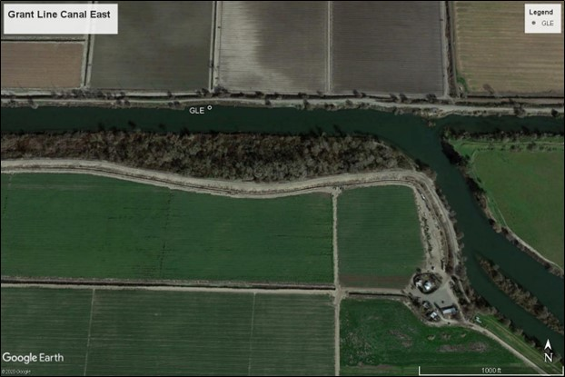
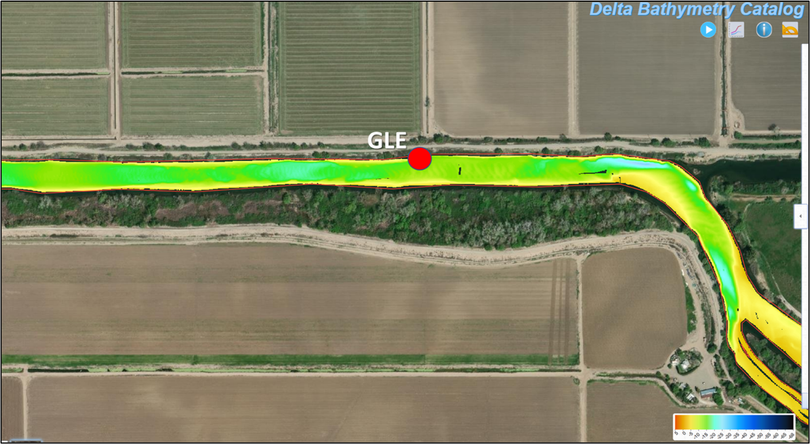
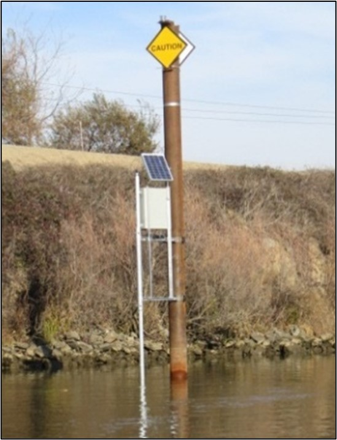

```{r setup, include=FALSE}
knitr::opts_chunk$set(echo = FALSE, fig.width = 8, fig.height = 6, fig.align = "left" )
```

```{r load packages, message=FALSE, warning=FALSE, echo=FALSE}
# Load packages
library(readxl)
library(dataRetrieval)
library(tidyverse)
library(lubridate)
library(scales)
library(gt)
library(ggplot2)
library(plotly)
```

# Station Rationale

The Department of Water Resources (DWR) North Central Region Office (NCRO) Water Quality Evaluation Section (WQES) monitors continuous water quality and collects discrete water quality samples at this site. Grant Line Canal East (GLE) was constructed to support the DWR proposed South Delta Improvement Program (SDIP) and to ensure regulatory compliance with the South Delta Temporary Barriers 401 certification. Monitoring water quality at this station helps to identify local changes to water quality caused by State and Federal Water Project Operations and south Delta agricultural water users. One such project is the installation of seasonal temporary rock barriers that are constructed by DWR to mitigate water levels in the south Delta. The temporary rock barriers are typically installed from May to November of each year. Station GLE serves as the nearest upstream water quality station for characterizing water quality above the Grant Line Canal barrier, which is located one mile downstream. Important water quality parameters at GLE are specific conductance, dissolved oxygen, and river stage. Chlorophyll fluorescence provides insights into phytoplankton growth, transport, and the effects on dissolved oxygen concentrations. 

# Primary Habitat Type 

The habitat type is tidal river channel. 

# Physical Region and Bathymetry

GLE is located on the eastern end of Grant Line Canal in the south Delta which can seasonally be subjected to high floating aquatic vegetation (FAV) growth. This FAV cover can create channel conditions that are impassible by boat and additionally can alter water quality conditions. Grant Line Canal is a straight channel connecting upstream Doughty Cut to the downstream stretch of Old River (near the Clifton Court Forebay intake gates). Flows enter the south Delta via the Head of Old River from the San Joaquin River (near site OH1). Most of the water entering the south Delta flows west through Doughty Cut and into Grant Line Canal towards Clifton Court Forebay and the inlet for Banks Pumping Plant.
```{r import coordinate data, message=FALSE, warning=FALSE, echo = FALSE}
# Table 1. Station Location
table1 <- read_csv(
   file = "GLE_table1.csv",  #######File name----
   col_names = TRUE) 
gt(table1) %>%
  tab_header(title = md("Table 1. Station Location - (WGS84)")) %>%
  opt_stylize(style = 5, 
              add_row_striping = TRUE) %>%
  cols_align(align = "center",
             columns = 2:5) %>%
  tab_options(heading.align = "left")
```
<br>



The image below shows the multibeam bathymetric data near GLE. The most recent layer covers the length of Grant Line Canal and was collected by DWR's Bathymetry and Technical Support section on June 6, 2019. The bathymetric map shows Grant Line Canal as a uniform channel, with the GLE station sitting in an area with a depth around 15 feet. Delta-wide bathymetry data collected by DWR can be viewed at <https://gis.water.ca.gov/app/bathymetry/>. 



# Station Equipment

NCRO WQES uses a Yellow Springs Instruments (YSI) multiparameter sonde for the continuous data collection. The NCRO Flow and Special Studies Section monitors continuous flow and maintains the telemetry equipment for DWR’s reporting to the California Data Exchange Center (CDEC). Discrete water quality samples are collected at a 1-meter depth using a Van Dorn water sampler.
```{r import equipment data, message=FALSE, warning=FALSE, echo = FALSE}
# Table 2. Station Equipment
table2 <- read_csv(
   file = "GLE_table2.csv",  #######File name----
   col_names = TRUE) 
gt(table2) %>%
  tab_header(title = md("Table 2. Station Equipment")) %>%
  opt_stylize(style = 5, 
              add_row_striping = TRUE) %>%
  cols_align(align = "center",
             columns = 2:3) %>%
  cols_width(2:3 ~ px(150)) %>%
  tab_options(heading.align = "left")
```
<br>
The GLE station infrastructure is attached to a steel piling on the right side of the channel. The YSI EXO2 sonde is housed in a 4” PVC pipe. The station equipment is connected to a Campbell Scientific CR6 datalogger and Campbell CELL210 Cellular Modem. This equipment provides access to real time data on California Data Exchange Center (CDEC) under the station name “Grant Line Canal East” or station ID GLE. 
<br>



# Constituents and Period of Record {.tabset}
## Continuous Record 
All reviewed and quality controlled continuous water quality data is available on Water Data Library (WDL) at <https://wdl.water.ca.gov>. Search WDL under ‘Continuous Data’ using Station Number B9532000. 

```{r import missing continuous data, message=FALSE, warning=FALSE, echo = FALSE}
# Table 3. SAMPLING HISTORY AT GLE FOR CONTINUOUS CONSTITUENTS INCLUDING PERIODS OF MISSING DATA (2013-2022).
table3 <- read_csv(
   file = "GLE_table3.csv",  #######File name----
   col_names = TRUE) 
table3 %>% gt() %>%
  tab_header(title = md("Table 3. Continuous Sampling History (2013-2022) with Consecutive Periods of Missing Data (6+ months)")) %>%
  opt_stylize(style = 5, 
              add_row_striping = TRUE) %>%
  cols_align(align = "center",
             columns = 2:4) %>%
  tab_options(heading.align = "left")
```

## Discrete Record
All reviewed and quality controlled discrete grab sample water quality data is available on WDL at <https://wdl.water.ca.gov>. Search WDL under ‘Water Quality’ using Station Name **Grant Line Canal East** or Station Number B9D74921261.

```{r import missing discrete data, message=FALSE, warning=FALSE,echo=FALSE}
# Table 4. SAMPLING HISTORY AT GLE FOR DISCRETE CONSTITUENTS INCLUDING PERIODS OF MISSING DATA (2013-2022).
table4 <- read_csv(
   file = "GLE_table4.csv",  #######File name----
   col_names = TRUE) 
table4 %>% gt() %>%
  tab_header(title = md("Table 4. Discrete Sampling History (2013-2022) with Consecutive Periods of Missing Data (6+ months)")) %>%
  opt_stylize(style = 5, 
              add_row_striping = TRUE) %>%
  cols_align(align = "center",
             columns = 2:4) %>%
  cols_width(`Missing Data`~ px(250)) %>%
  tab_options(heading.align = "left")
```


```{r import data, message=FALSE, warning=FALSE, echo = FALSE}
# continuous
df_raw <- read_csv(
   file = "GLE_por_raw.csv",  #######File name----
   col_names = FALSE,     #add column names later
   skip = 3,              #skip top 3 rows
   col_types = "cdddddddddddd")  # "c" = character, "d" = numeric, "-" = skip

# Water year index data
wyt <- read_excel(
  path = "WY Type Indices.xlsx",
  sheet = "Sacramento Valley Index",
  col_names = TRUE)

# discrete
dis_raw <- read_csv(
  file = "GLE_por_discrete.csv",  #######*add file name----
  col_names = TRUE) 
```


```{r prep data, message=FALSE, warning=FALSE, echo =FALSE}
# Water year index data 
SAC_WYIndex <- wyt %>% 
  #use filter function to select only the WYs in the continuous data
  filter(WY%in%c(2013:2023)) %>% 
  select(WY,Index,`Yr-type`)
SAC_WYIndex[SAC_WYIndex == "BN"] <- "Normal"
SAC_WYIndex[SAC_WYIndex == "AN"] <- "Normal"
SAC_WYIndex[SAC_WYIndex == "D"] <- "Dry"
SAC_WYIndex[SAC_WYIndex == "C"] <- "Dry"
SAC_WYIndex[SAC_WYIndex == "W"] <- "Wet"

# continuous
names(df_raw) <- c(
   "DateTime",
   "Specific Conductance (µS/cm)", "SpCnd_q",
   "Water Temperature (°C)", "WT_q",
   "Turbidity (FNU)", "Turb_q",
   "Dissolved Oxygen (mg/L)", "DO_q",
   "pH units", "pH_q",
   "Chlorophyll Fluorescence (µg/L)", "Chla_q",
   "Depth (m)", "Depth_q")

df_clean <- df_raw %>%
  mutate(DateTime = mdy_hm(DateTime)) %>% 
  mutate(DateTime = round_date(DateTime, "15 minute")) %>%
  complete(DateTime = seq.POSIXt(min(DateTime), max(DateTime), by = "15 min")) %>%
  mutate(Date= as.Date(floor_date(DateTime, "day")))  %>% 
  select(c(2,4,6,8,10,12,14,16)) %>%
  filter(Date < '2023-01-01') %>%
  pivot_longer(cols = c(1:7), names_to = "Parameter", values_to = "Value") %>%
  addWaterYear() %>% 
  rename(WY = waterYear) %>%
  mutate(CDate=as.Date(paste0("1904","-",month(Date),"-",day(Date)))) 

df_cleanWY <- full_join(df_clean,SAC_WYIndex) %>% 
  group_by(Parameter, `Yr-type`, CDate) %>% 
  summarize(Daily_avg = mean(Value, na.rm=TRUE)) %>% 
  ungroup() %>% 
  #seq along dates starting with the beginning of the water year
  mutate(CDate=as.Date(paste0(ifelse(month(CDate) < 10, "1905", "1904"),
                              "-", month(CDate), "-", day(CDate))))

# discrete
#remove rows of metadata at bottom of df
dis_df <- head(dis_raw, -2)  #######*check data trim----  

dis_clean <- dis_df %>% 
  rename(DateTime = `Collection Date`,
         StationCode = 'Short Station Name') %>%
  mutate(DateTime = mdy_hm(DateTime)) %>% 
  mutate(Date= as.Date(floor_date(DateTime, "day"))) %>% 
  mutate(Year = year(DateTime)) %>%
  #separate <RL data into new RL and value columns.
  mutate(RL = case_when(grepl("<", Result) ~ "<",
                        TRUE ~ "=")) %>% 
  mutate(value = case_when(grepl("<", Result) ~ `Rpt Limit`,
                           TRUE ~ as.numeric(Result))) %>% 
  mutate(TR = case_when(`Sample Code` == 'CF0121B0033C' & Units == 'ug/L' ~ value*0.001, 
                             TRUE ~ value)) %>% 
  mutate(Units_corr = case_when(`Sample Code` == 'CF0121B0033C' & Units == 'ug/L' ~ "mg/L", 
                             TRUE ~ Units)) %>% 
  relocate(c(RL,TR,Units_corr), .before = Result) %>%
  #keep data through 2022
  filter(!Year==2023) %>%
  subset(Depth == '1 Meters') %>%
  #remove duplicate samples
  filter(is.na(Notes)|Notes!="Duplicate") %>%
  filter(is.na(Notes)|Notes!="Duplicate & Matrix Spike") %>%
  filter(is.na(Notes)|Notes!="Sample results suspect due to a bad reagent.") %>%
  #remove "historic" rows
  distinct() 

dis_clean$Units_corr <- paste0("(", dis_clean$Units_corr, ")")

dis_clean <- dis_clean %>% unite(Analyte, c(Analyte,Units_corr), sep = " ")
```

# Summary of Continuous Water Quality {.tabset}
## Timseries Plots {.tabset}
Each timeseries plot summarizes the continuous period of record using daily averages which are grouped by day of year (DOY) and by the assigned water year Sacramento Water Year Hydrologic Classification Index (<https://cdec.water.ca.gov/reportapp/>) to visualize general annual trends by Wet, Dry, and Normal water years.


```{r visualize timeseries, message=FALSE, warning=FALSE, echo =FALSE}
## Continuous Trends by WY Type--------------
WY_plots <- df_cleanWY %>% split(.$Parameter) %>% 
  map(~ ggplot(., aes(x = CDate, y = Daily_avg, color = `Yr-type`,
                      text = paste('Average Value: ', round(Daily_avg, digits =1),
                                   '<br>Day: ', format(CDate, "%B %d") ,
                                   '<br>Water Year: ', `Yr-type`),
                      group = Parameter)) + 
        geom_line() +
        theme_bw() +
        scale_colour_manual(values = c("#ED7D31","#A5A5A5","#4472C4")) +
        labs(y = .$Parameter,
             x = "Average Date",
             colour = "WY Type") +
        scale_x_date(labels = date_format("%b"),
                     breaks = breaks_pretty(15)))
```

### Chlorophyll Fluorescence (µg/L)
```{r chla (ug/L), message=FALSE, warning=FALSE, echo =FALSE}
ggplotly(WY_plots$`Chlorophyll Fluorescence (µg/L)`,
         tooltip = c("text"))
```


### Depth (m)
```{r Depth (m), message=FALSE, warning=FALSE, echo =FALSE}
ggplotly(WY_plots$`Depth (m)`,
         tooltip = c("text"))
```

### Dissolved Oxygen (mg/L)
```{r DO, message=FALSE, warning=FALSE, echo=FALSE}
ggplotly(WY_plots$`Dissolved Oxygen (mg/L)`,
         tooltip = c("text"))
```

### pH
```{r pH, message=FALSE, warning=FALSE, echo=FALSE}
ggplotly(WY_plots$`pH units`,
         tooltip = c("text"))
```

### Specific Conductance (µS/cm)
```{r Spcnd, message=FALSE, warning=FALSE, echo=FALSE}
ggplotly(WY_plots$`Specific Conductance (µS/cm)`,
         tooltip = c("text"))
```

### Turbidity (FNU)
```{r turbidity, message=FALSE, warning=FALSE, echo=FALSE}
ggplotly(WY_plots$`Turbidity (FNU)`,
         tooltip = c("text"))
```

### Water Temperature (°C)
```{r water temp, message=FALSE, warning=FALSE, echo=FALSE}
ggplotly(WY_plots$`Water Temperature (°C)`,
         tooltip = c("text"))
```

## Histogram

```{r visualize histograms, message=FALSE, warning=FALSE, echo=FALSE, fig.width = 8, fig.height = 8}
## Daily average water data calculated from 15-min data
histo_plot2<- df_clean %>% group_by(Parameter,Date) %>% summarize(Mean=mean(Value, na.rm=TRUE)) %>% 
  ggplot(., aes(x = Mean, y=after_stat(density))) + 
  facet_wrap(~Parameter, scales = 'free') +
  geom_histogram(binwidth = function(x) 2 * IQR(x) / (length(x)^(1/3))) +
  geom_density(color="green",linewidth=4) +
  theme_bw() +
  labs(x = "Daily Average",
       y = "Density",
       title = "Distribution by Parameter (2013-2022)")
histo_plot2

## Daily average by WY type data - calculated from WY-grouped data (PROBABLY DON'T USE THIS ONE!!!!)
#histo_plot <- df_cleanWY %>% ggplot(., aes(x = Daily_avg)) + 
#  facet_wrap(~Parameter, scales = 'free_x') +
#  geom_histogram(binwidth = function(x) 2 * IQR(x) / (length(x)^(1/3))) +
#  theme_bw() +
#  labs(x = "Daily Average",
#       y = "Count",
#       title = "Distribution by Parameter (2013-2022)")

#histo_plot
```

## Summary Table


```{r summarize continuous data in table form, echo=FALSE, message=FALSE, warning=FALSE}
# continuous table
daily_summary <- df_clean %>% 
  group_by(Parameter,Date) %>% 
  summarize(Daily_avg=mean(Value, na.rm = TRUE),
            Daily_max=max(Value, na.rm = TRUE),
            Daily_min=min(Value, na.rm = TRUE),
            Daily_range=sum(Daily_max-Daily_min, na.rm = TRUE))

sum_tbl <- daily_summary %>% drop_na() %>% 
  group_by(Parameter) %>% 
  summarize(n = sum(!is.na(Daily_avg)),
            Mean=mean(Daily_avg, na.rm=TRUE),
            Max=max(Daily_avg, na.rm = TRUE),
            Min=min(Daily_avg, na.rm = TRUE),
            StdDev= sd(Daily_avg, na.rm=TRUE),
            MAD=mad(Daily_avg, na.rm = TRUE),
            AvgRng=mean(Daily_range, na.rm = TRUE))

df_date <- daily_summary %>% drop_na() %>% select(1:3)
date_max <- df_date %>% slice_max(Daily_avg) %>% rename("max_date" = Date,
                                                        "Max" = Daily_avg)
date_min <- df_date %>% slice_min(Daily_avg) %>% rename("min_date" = Date,
                                                        "Min" = Daily_avg)
df_table <- full_join(full_join(sum_tbl,date_max),date_min) %>% 
  relocate(max_date, .after = Max) %>% 
  relocate(min_date, .after = Min) %>%
  #UPDATE STATION CODE IDENTIFICATION------------
  mutate(StationCode = "GLE") %>% 
  relocate(StationCode)

dates <- sum_tbl %>% 
  pivot_longer(2:8, names_to = "Statistic", values_to = "para") %>% 
  pivot_wider(names_from = Parameter, values_from = para)

sum_tbl <- sum_tbl %>% rename("SD" = StdDev, "Avg Rng" = AvgRng)

gt(sum_tbl) %>%
  fmt_number(columns = (3:8),
             rows = c(1,3,4),
             decimals = 2) %>%
  fmt_number(columns = (3:8),
             rows = c(2,6,7),
             decimals = 1) %>%
  fmt_number(columns = (3:8),
             rows = c(5),
             decimals = 0) %>%
  #cols_align(align = "center",
  #           columns = 2:8) %>%
  cols_width(Parameter ~ px(275),
             2:8 ~ px(75)) %>%
  opt_stylize(style = 5, 
              add_row_striping = TRUE) %>%
  tab_options(heading.align = "left") %>%
  tab_spanner(columns = 2:8, 
              label = 'GLE (2013-2022)', 
              id = 'spannerA')
```

Daily average values were used to calculate the summary table. 
**n** = Number of days sampled,
**Mean** = Average of daily average values,
**Max** = Single daily maximum value,
**Min** = Single daily minimum value,
**SD** = Standard deviation of the daily average values,
**MAD** = Median absolute deviation of the daily average values,
**Avg Rng** = Average daily range between the daily minimum value and maximum value.

# Summary of Discrete Water Quality {.tabset}
## Timeseries Plots

```{r visualize timeseries discrete data, echo=FALSE, message=FALSE, warning=FALSE, fig.width = 10, fig.height = 12}
# discrete trends
t <- dis_clean %>% subset(!Analyte%in%"Total Hardness (mg/L)")
dis_plot <- t %>% ggplot(aes(x = Date, y = TR)) + 
  geom_point() + 
  geom_line() +  
  facet_wrap(~Analyte, scales = "free",
             labeller = label_wrap_gen(18),
             ncol = 5) + 
  #theme(strip.text = element_text(size = 11)) +
  labs(title=dis_clean$StationCode,
       y = "Value")

dis_plot
```


## Summary Table

```{r summarize discrete table in table form, warning=FALSE, message = FALSE, echo=FALSE}
# discrete table summarize
dis_sum_table <- dis_clean %>% 
  group_by(Analyte) %>% 
  summarize(n = n(),   
            Mean = mean(TR, na.rm = TRUE),
            Max = max(TR, na.rm = TRUE),
            Min = min(TR, na.rm = TRUE),
            StdDev = sd(TR, na.rm = TRUE),
            MAD = mad(TR, na.rm = TRUE)) %>%
  drop_na() # for constituents with just 1 occurrence (StdDev will be NA) 

# max value dates
dis_max <- dis_clean %>% 
  group_by(StationCode,Analyte) %>% 
  slice_max(TR) %>% 
  select(Analyte,Result,Date,Year) %>% 
  rename("max_Result" = Result, "max_date" = Date)  
# summarize multiple dates with maximum values
dis_max_date <- dis_max %>% 
  group_by(StationCode,Analyte,max_Result) %>% 
  summarize(first_max = min(max_date),
            last_max = max(max_date),
            n_max= n())

# minimum value dates
dis_min <- dis_clean %>% 
  group_by(StationCode,Analyte) %>% 
  slice_min(TR) %>% 
  select(Analyte,Result,Date,Year) %>% 
  rename("min_Result" = Result, "min_date" = Date) 
# filter "1" from VSS results and summarize multiple dates with minimum values
dis_min_date <- dis_min %>% filter(!min_Result=="1") %>%
  group_by(StationCode,Analyte,min_Result) %>% 
  summarize(first_min = min(min_date),
            last_min = max(min_date),
            n_min= n())

#summary table with dates of maximum and minimum values
dis_tbl <- full_join(full_join(dis_sum_table,dis_max_date),dis_min_date) %>% drop_na() %>% select(Analyte, n, Mean, max_Result, min_Result, StdDev, MAD) %>% rename("Max" = max_Result, "Min" = min_Result, "SD" = StdDev)

dis_tbl %>% gt() %>% 
  opt_stylize(style = 5, 
              add_row_striping = TRUE) %>%
  cols_align(align = "right",
             columns = 2:7) %>%
  cols_width(Analyte ~ px(295),
             2:7 ~ px(75)) %>%
  tab_options(heading.align = "left") %>%
  tab_spanner(columns = 2:7, 
              label = 'GLE (2013-2022)', 
              id = 'spannerA') %>%
  fmt_number(columns = where(is.numeric),
             rows = Analyte == c("Dissolved Hardness (mg/L as CaCO3)",
                                 "Specific Conductance (uS/cm@25 °C)",
                                 "Total Alkalinity (mg/L as CaCO3)",
                                 "Total Dissolved Solids (mg/L)"),
             decimals = 0) %>%
  fmt_number(columns = where(is.numeric),
             rows = Analyte == c("Dissolved Hardness (mg/L as CaCO3)"),
             decimals = 0) %>%
  fmt_number(columns = where(is.numeric),
             rows = Analyte == c("Dissolved Boron (mg/L)"),
             decimals = 3,
             drop_trailing_zeros = TRUE) %>%
  fmt_number(columns = where(is.numeric),
             rows = Analyte == c("Dissolved Bromide (mg/L)"),
             decimals = 3,
             drop_trailing_zeros = TRUE) %>%
  fmt_number(columns = where(is.numeric),
             rows = Analyte == c("Dissolved Nitrate + Nitrite (mg/L as N)"),
             decimals = 3,
             drop_trailing_zeros = TRUE) %>%
  fmt_number(columns = where(is.numeric),
             rows = Analyte == c("Chlorophyll a (ug/L)"),
             decimals = 2,
             drop_trailing_zeros = TRUE) %>%
  fmt_number(columns = where(is.numeric),
             rows = Analyte == c("Dissolved Ammonia (mg/L as N)"),
             decimals = 2,
             drop_trailing_zeros = TRUE) %>%
  fmt_number(columns = where(is.numeric),
             rows = Analyte == c("Dissolved Calcium (mg/L)"),
             decimals = 2,
             drop_trailing_zeros = TRUE) %>%
  fmt_number(columns = where(is.numeric),
             rows = Analyte == c("Dissolved ortho-Phosphate (mg/L as P)"),
             decimals = 2,
             drop_trailing_zeros = TRUE) %>%
  fmt_number(columns = where(is.numeric),
             rows = Analyte == c("Dissolved Potassium (mg/L)"),
             decimals = 2,
             drop_trailing_zeros = TRUE) %>%
  fmt_number(columns = where(is.numeric),
             rows = Analyte == c("Pheophytin a (ug/L)"),
             decimals = 2,
             drop_trailing_zeros = TRUE) %>%
  fmt_number(columns = where(is.numeric),
             rows = Analyte == c("Total Phosphorus (mg/L as P)"),
             decimals = 2,
             drop_trailing_zeros = TRUE) %>%
  fmt_number(columns = where(is.numeric), rows = everything(), decimals = 1, drop_trailing_zeros = TRUE)
  
```

Min values denoted with < represent laboratory analyses that are below the reporting limit (R.L.). R.L. data was incorporated into the summary table by substituting the R.L. value in calculations. **n** = Number of samples, **Mean** = Sample average, **Max** = Maximum value, **Min** = Minimum value, **SD** = Standard deviation, **MAD** = Median absolute deviation 

# References {.tabset}

DWR. 2018. South Delta salinity study – water year 2015. California Department of Water Resources, Water Quality Evaluation Section.

DWR. 2020. South Delta salinity memo report – water year 2019. California Department of Water Resources, Water Quality Evaluation Section.

DWR. 2020.  2020 Report on water quality monitoring for the south delta temporary barriers project. California Department of Water Resources, Water Quality Evaluation Section.

DWR. 2021. South Delta ions memo. California Department of Water Resources, Water Quality Evaluation Section.

ICF. 2016. Evaluation of salinity patterns and effects of tidal flows and temporary barriers in south delta channels. (ICF 00568.13.) Sacramento (CA).


#### Note
This is an R Markdown document. Markdown is a simple formatting syntax for authoring HTML, PDF, and MS Word documents. For more details on using R Markdown see <http://rmarkdown.rstudio.com>.
