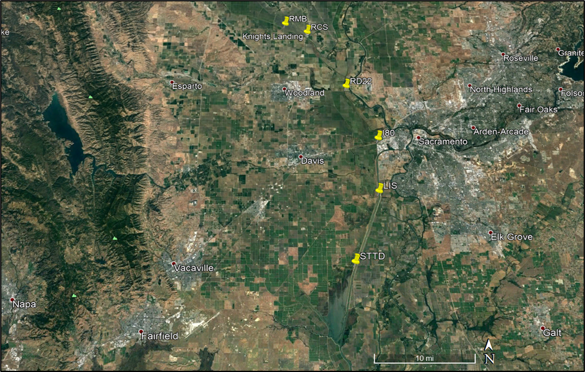

```{r setup, include=FALSE}
#include = FALSE prevents the R code or anything produced (i.e. tables) from being rendered into document.
knitr::opts_chunk$set(echo = TRUE)
library(ggplot2)
library(readxl)
library(tidyverse)
library(lubridate)
library(dataRetrieval)
library(scales)
library(dplyr)
```

``` {r include = FALSE}
wyt <- read_excel(
  path = "WY Type Indices.xlsx",
  sheet = "Sacramento Valley Index",
  col_names = TRUE)

#WY Index dataframe clean -- only need to clean once. Will reuse for each station.
SAC_WYIndex <- wyt %>% filter(WY%in%c(2014:2023)) %>% select(WY,Index,`Yr-type`) #Change years to reflect the years the station has been collecting data
SAC_WYIndex[SAC_WYIndex == "BN"] <- "Normal"
SAC_WYIndex[SAC_WYIndex == "AN"] <- "Normal"
SAC_WYIndex[SAC_WYIndex == "D"] <- "Dry"
SAC_WYIndex[SAC_WYIndex == "C"] <- "Dry"
SAC_WYIndex[SAC_WYIndex == "W"] <- "Wet"
unique(SAC_WYIndex$`Yr-type`)


#Continuous WQ import
df_raw_L <- read_csv(
  file = "LIS_por_raw.csv",  #######*add file name----
  col_names = FALSE,     #add column names later
  skip = 3,              #skip top 3 rows
  col_types = "cdddddddddddd")  # "c" = character, "d" = numeric, "-" = skip

#III. DATA CLEAN & SUMMARIZE---------------------------
#Name the columns for the parameters your station has
names(df_raw_L) <- c(
  "DateTime",
  "Specific Conductance (µS/cm)", "SpCnd_q",
  "Water Temperature (°C)", "WT_q",
  "Turbidity (FNU)", "Turb_q",
  "Dissolved Oxygen (mg/L)", "DO_q",
  "pH units", "pH_q",
  "Chlorophyll Fluorescence (µg/L)", "Chla_q",
  "Depth (ft)", "Depth_q",
  "fDOM (QSU)", "fDOM_q")

df_clean_L <- df_raw_L %>% 
  mutate(DateTime = mdy_hm(DateTime)) %>% 
  mutate(DateTime = floor_date(DateTime, "15 minute")) %>%
  complete(DateTime = seq.POSIXt(min(DateTime), max(DateTime), by = "15 min")) %>%
  mutate(Date= as.Date(floor_date(DateTime, "day"))) %>%
  select(c(2,4,6,8,10,12,14,16,18)) %>%     ##update for the number of parameters. Need to add an extra column so with three parameters need columns 2 to 8
  filter(Date < '2024-09-30') %>% #update date
  pivot_longer(cols = c(1:8), names_to = "Parameter", values_to = "Value") %>%
  addWaterYear() %>% 
  rename(WY = waterYear) %>%
  mutate(StationCode = "LIS") %>%     #####*UPDATE station name------
  mutate(CDate=as.Date(paste0("1904","-",month(Date),"-",day(Date))))

#IV. CREATE DATA FRAME WITH CONTINUOUS WATER QUALITY AND WATER YEAR TYPE INDEX----
df_cleanWY_L <- full_join(df_clean_L,SAC_WYIndex) %>% 
  group_by(StationCode, Parameter, `Yr-type`, CDate) %>% 
  summarize(Daily_avg = mean(Value, na.rm=TRUE)) %>% 
  ungroup() %>% 
  #seq along dates starting with the beginning of the water year
  mutate(CDate=as.Date(paste0(ifelse(month(CDate) < 10, "1905", "1904"),
                              "-", month(CDate), "-", day(CDate))))


#V. CONTINUOUS FIGURES--------------------
## WY Type Continuous Trends--------------
WY_plots_L <- df_cleanWY_L %>% split(.$Parameter) %>% 
  map(~ ggplot(., aes(x = CDate, y = Daily_avg, color = `Yr-type`)) + 
        geom_line() +
        theme_bw() +
        scale_colour_manual(values = c("#ED7D31","#A5A5A5","#4472C4")) +
        labs(y = .$Parameter,
             x = "Average Date",
             colour = "WY Type") +
        scale_x_date(labels = date_format("%b"),
                     breaks = breaks_pretty(15)))

#WY_plots_L

##Export-------- 
####*before saving, UPDATE station in filenames---------
#ggsave(WY_plots$`Chlorophyll Fluorescence (µg/L)` , filename = "ORI_chlaPORtrends.tiff", device = "tiff", width = 6.5, height = 3)
#ggsave(WY_plots$`Depth (ft)` , filename = "ORI_depthPORtrends.tiff", device = "tiff", width = 6.5, height = 3)
#ggsave(WY_plots$`Dissolved Oxygen (mg/L)` , filename = "ORI_doPORtrends.tiff", device = "tiff", width = 6.5, height = 3)
#ggsave(WY_plots$`pH units` , filename = "ORI_phPORtrends.tiff", device = "tiff", width = 6.5, height = 3)
#ggsave(WY_plots$`Specific Conductance (µS/cm)` , filename = "ORI_spcndPORtrends.tiff", device = "tiff", width = 6.5, height = 3)
#ggsave(WY_plots$`Turbidity (FNU)` , filename = "ORI_turbPORtrends.tiff", device = "tiff", width = 6.5, height = 3)
#ggsave(WY_plots$`Water Temperature (°C)` , filename = "ORI_wtPORtrends.tiff", device = "tiff", width = 6.5, height = 3)

## POR Histograms------------------------
histo_plot <- df_cleanWY_L %>% ggplot(., aes(x = Daily_avg)) + 
  facet_wrap(~Parameter, scales = 'free_x') +
  geom_histogram(binwidth = function(x) 2 * IQR(x) / (length(x)^(1/3))) +
  theme_bw() +
  labs(x = "Daily Average")

#histo_plot

####*before saving, UPDATE station in filename---------
#ggsave(histo_plot, filename = "ORI_histogram.tiff", device = "tiff", width = 6.5, height = 8.5)

#VI. CONTINUOUS SUMMARY TABLES------------
#Create the dataframe
df_cleanSUM <- full_join(df_clean_L,SAC_WYIndex) %>% 
  group_by(StationCode, Parameter, Date) %>% 
  summarize(Daily_avg = mean(Value, na.rm=TRUE)) %>% 
  ungroup()

#Calculate the summary table
df_sum_table <- df_cleanSUM %>% group_by(StationCode, Parameter) %>% 
  summarize(min = min(Daily_avg, na.rm = TRUE),
            max = max(Daily_avg, na.rm = TRUE),
            count = n(),                                          #check that count is correct
            mean = mean(Daily_avg, na.rm=TRUE),
            #median = median(Daily_avg, na.rm = TRUE),
            sd = sd(Daily_avg, na.rm=TRUE)) 

#Find max and min value occurrence dates
df_max <- df_cleanSUM %>% group_by(StationCode, Parameter) %>% slice_max(Daily_avg) %>% select(StationCode, Parameter, Date) %>% rename("max_date" = Date)
df_min <- df_cleanSUM %>% group_by(StationCode, Parameter) %>% slice_min(Daily_avg) %>% select(StationCode, Parameter, Date) %>% rename("min_date" = Date)

#Join tables
POR_sum_table <- full_join(full_join(df_sum_table,df_max), df_min) %>% 
  select(StationCode,
         Parameter,
         min,
         min_date,
         max,
         max_date,
         count,
         mean,
         #median,
         sd)
```

```{r include=FALSE}
df_raw_dis <- read_csv(
  file = "LIS_por_discrete.csv",  #######*add file name----
  col_names = TRUE) 

#III. DATA CLEAN ---------------------------
#remove rows of metadata at bottom of df
df_dis <- head(df_raw_dis, -2)  #######*check data trim----   

df_clean_dis <- df_dis %>% 
  rename(DateTime = `CollectionDate`,
         StationCode = 'ShortStationName') %>%
  mutate(DateTime = mdy_hm(DateTime)) %>% 
  mutate(Date= as.Date(floor_date(DateTime, "day"))) %>% 
  mutate(Year = year(DateTime)) %>%
  #separate <RL data into new RL and value columns.
  mutate(RL = case_when(grepl("<", Result) ~ "<",
                        TRUE ~ "=")) %>% 
  mutate(value = case_when(grepl("<", Result) ~ `RptLimit`,
                           TRUE ~ as.numeric(Result))) %>% 
  relocate(c(RL,value), .before = Result) %>%
  #keep data through 2024
  filter(!Year==2025) %>%
  #remove duplicate samples
  filter(is.na(Notes)|Notes!="Duplicate") %>% distinct()
  
#IV. DISCRETE SUMMARY TABLES------------
##1. Calculate the summary table---------
df_dis_sum_table <- df_clean_dis %>% 
  group_by(StationCode,Analyte) %>% 
  summarize(total_count = n(),   
            mean = mean(value, na.rm = TRUE),
            sd = sd(value, na.rm=TRUE)) 

##2. Find MAXIMUM Results and occurrence date(s)---------
df_dis_max <- df_clean_dis %>% 
  group_by(StationCode,Analyte) %>% 
  slice_max(value) %>% 
  select(Analyte,Result,Date,Year) %>% 
  rename("max_Result" = Result, "max_date" = Date)  

#check results
df_dis_max 
#there are multiple days that a maximum sample value occurred (see VSS, rows 8-10). 
#summarize data for first and last date of occurrence and number of occurences
max_data <- df_dis_max %>% group_by(StationCode,Analyte,max_Result) %>% summarize(first_max = min(max_date),
                                                                       last_max = max(max_date),
                                                                       n_max= n())

##3. Find MINIMUM Results and occurrence date(s)-----------
df_dis_min <- df_clean_dis %>% 
  group_by(StationCode,Analyte) %>% 
  slice_min(value) %>% 
  select(Analyte,Result,Date,Year) %>% 
  rename("min_Result" = Result, "min_date" = Date) 

#check results
df_dis_min %>% print(n=30)
#If needed Remove the higher values (1) from the results.
df_dis_min <- df_dis_min %>% filter(!min_Result=="0.01") %>% print(n=24)
df_dis_min <- df_dis_min %>% filter(!min_Result=="0.5") %>% print(n=24)
df_dis_min <- df_dis_min %>% filter(!min_Result=="N.S.") %>% print(n=24)
#there are multiple days that a minimum sample value occurred (see chla, pheoa, TSS, and VSS). 
#summarize data for first and last date of occurrence and number of occurences
min_data <- df_dis_min %>% group_by(StationCode,Analyte,min_Result) %>% summarize(first_min = min(min_date),
                                                                       last_min = max(min_date),
                                                                       n_min= n())

##4. Join all three summary tables---------
dis_sum_table_all <- full_join(full_join(min_data,max_data), df_dis_sum_table)
```

# **PURPOSE**  

Department of Water Resources (DWR) North Central Region Office (NCRO) Water Quality Evaluation Section (WQES) maintains monitoring equipment for continuous water quality using a Yellow Springs Instruments (YSI) multiparameter sonde and collects discrete water samples at this site for the Yolo Bypass Monitoring Program to support the Yolo Bypass Fish and Invertebrate Monitoring Program and the North Delta Food Subsidies (NDFS) study. Yolo Bypass near Lisbon Weir (LIS) is part of the monitoring network for NDFS, an adaptive management project that monitors the effects of the North Delta Flow Action (NDFA). The NDFA is a joint effort between DWR, Glenn-Colusa Irrigation District, Reclamation Districts 108 and 2035, and local landowners to increase and redirect summer and/or fall outflows from the Colusa Basin Drain into the Yolo Bypass perennial Toe Drain. Summer-fall flow pulses from the NDFA are managed with the goal of distributing food resources downstream to enhance the quality and quantity of food for Delta Smelt and other species in the downstream regions of the Cache Slough Complex and lower Sacramento River. This management action was initiated after monitoring studies in 2011 and 2012 observed fall phytoplankton blooms in the lower Sacramento River after higher-than-normal fall agricultural return flows passed through the Yolo Bypass (FLaSH; Brown et al. 2014; Frantzich et al. 2018). Due to the potential benefits of summer-fall flow pulses through Yolo Bypass to the Delta food web, the Delta Smelt Resiliency Strategy included managed flow pulses as a core strategy to benefit Delta Smelt (CNRA 2016). In 2019, the NDFA was included as one of several adaptive management strategies of the Delta Smelt Summer-Fall Habitat Action, a new regulatory requirement in both the 2019 Fish and Wildlife Service Biological Opinion and 2020 Department of Fish and Wildlife Incidental Take Permit for the operation of the State Water Project and Central Valley Project. LIS is the only long-term monitoring station in the network of NDFS water quality stations to monitor trends and water quality effects in the Yolo Bypass due to seasonal flow pulses.  


# **PRIMARY HABITAT TYPE/PHYSICAL REGION**  

The habitat type is riparian channel and floodplain drainage.  

# **TABLE 1. STATION LOCATION (WGS84)**

```{r Table 1, echo=FALSE}
#echo = FALSE parameter prevent printing of the R code and still generated the table
table1 <- data.frame("YOLO BYPASS NEAR LISBON WEIR", 38.474608, -121.5885961, "15 FEET", "LEFT SIDE OF CHANNEL")
colnames(table1) <- c("STATION", "LATITUDE", "LONGITUDE", "ELEVATION", "CHANNEL LOCATION")
knitr::kable(table1)
```
)

LIS is 7 miles south of West Sacramento in the Toe Drain of the Yolo Bypass. The Toe Drain parallels the eastern edge of the Yolo Bypass floodplain and operates as a drain for water travelling from the Bypass to the Delta. The Sacramento Deepwater Ship Channel is across the east levee from the Toe Drain.

)

The LIS YSI sonde is at a fixed depth inside a 6-inch PVC pipe which is attached to a stationary dock on eastern bank. The LIS station is about 200 meters downstream of the Lisbon Weir and is tidally influenced. The Lisbon Weir acts as a tidal barrier, allowing water to pass upstream during flood tides with a series of one-way flap-gates on the west side. Additionally, water overtops the entire length of the rock weir (at peak high tide) and traps the water on an ebb tide upstream of the barrier for agricultural users. The weir was designed to slow the movement of water allowing a pool of water to form upstream of the weir and maintain higher water level during low tide for agricultural pumpin and irrigation for seasonal floodplain crops.

)

Bathymetry data taken near LIS in November 2019 display variable channel depth with higher elevations (shallower waters) closer to the Lisbon Weir and lower elevations (deeper water) closer to the LIS station. The location of LIS is generally in an area of changing water depth due to bathymetry changes and may be reflected in water quality readings as well as tidal flux. Comparatively, the channel’s banks are generally shallower with increasing depth towards center channel.

)

# **Table 2. STATION EQUIPMENT**
```{r Table 2, echo=FALSE}
#echo = FALSE parameter prevent printing of the R code and still generated the table
table2 <- data.frame(Equipment=c("YSI 6600 MULTIPARAMETER SONDE", "YSI EXO2 MULTIPARAMETER SONDE"), "START DATE"=c("03/04/2013", "06/25/2019"),"END DATE"=c("06/25/2019", "---"))

knitr::kable(table2)
```

# **CONSTITUENTS AND PERIODS OF RECORD**
All reviewed and quality controlled continuous water quality data is available for downloading for Yolo Bypass near Lisbon Weir (LIS) on Water Data Library [(WDL)] (https://wdl.water.ca.gov/waterdatalibrary/) by searching under ‘Continuous Data’ using Station Number B9156000. All reviewed and quality controlled discrete grab sample water quality data is available on WDL by searching in ‘Water Quality’ under ‘Station & County’ using Station Name “Yolo Bypass Toe Drain Below Lisbon Weir” or Station Number B9D82851352.

# **Table 5 SUMMARY STATISTICS FOR ALL DEISCRETE WATER QUALITY SAMPLES COLLECTED FOR LAB ANALYSIS AT LIS**
```{r Table 5, echo=FALSE}
#echo = FALSE parameter prevent printing of the R code and still generated the table
table5 <- dis_sum_table_all
knitr::kable(table5)
```

# **Table 6 SUMMARY STATISTICS FOR ALL CONTINUOUS WATER QUALITY DATA COLLECTED AT LIS**
```{r Table 6, echo=FALSE}
#echo = FALSE parameter prevent printing of the R code and still generated the table
table6 <- data.frame(POR_sum_table)
knitr::kable(table6)
```

# **FIGURE 1 DAILY AVERAGE 15-MINUTE TIMESERIES FOR ALL WATER QUALITY MEASUREMENTS GROUPED BY WET, DRY, AND NORMAL WATER YEARS FOR THE COMPLETE PERIOD OF RECORD (2013-2022, EXCEPT FOR FDOM AND DEPTH WHICH INCLUDE 2019-2022) AT LIS. WATER YEAR HYDROLOGIC CLASSIFICATION INDICES ARE BASED ON DEPARTMENT OF WATER RESOURCES UNIMPAIRED RUNOFF FOR SACRAMENTO AND SAN JOAQUIN VALLEY**
```{r Plot 1, echo=FALSE, warning=FALSE, fig.dim= c(16,10)}
#fig.dim = c(W,H)
WY_plots_L

```

# **FIGURE 2 PERIOD OF RECORD (2013-2022, EXCEPT FOR FDOM AND DEPTH WHICH INCLUDE WATER YEARS 2019-2022) HISTOGRAMS OF DAILY AVERAGES FOR ALL CONTINUOUS WATER QUALITY PARAMETERS MEASURED AT STATION LIS**

```{r Plot 2, echo=FALSE, warning=FALSE, fig.dim= c(16,10)}
#fig.dim = c(W,H)
histo_plot

```

This code was generated using base-R (@R-base) and the Rmarkdown (@Rmarkdown) and ggplot2 (@ggplot2) packages.

# **REFERENCES**
